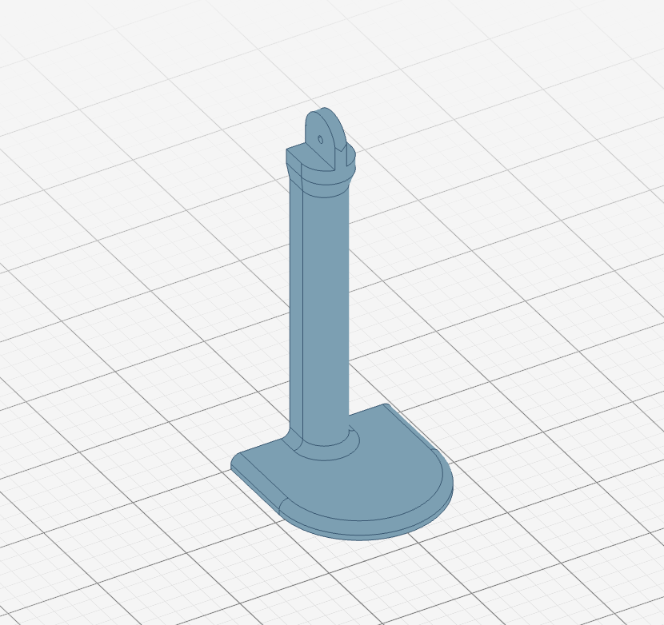

# AIRAM ROSE Plant Light Wall Mount

A wall mount for the AIRAM ROSE plant light, designed with [replicad](https://replicad.xyz/).

**[Try it now](https://jehna.github.io/plant-light-holder/)**



## 3D Printing

Print on its side to ensure a sturdy print.

## Getting Started

```bash
npm install
npm run dev
```

Open http://localhost:5173 to view the 3D model.

## Build

```bash
npm run build
```

## License

MIT
